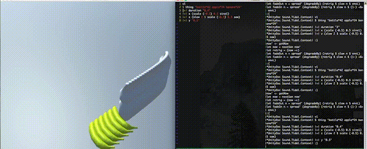

TidalUnity
---

TidalUnity is the middle-ware of visual livecode tool. It bridges control patterns that was generated with [TidalCycles](https://tidalcycles.org) to visual renderer on Unity engine.




## demo

[https://vimeo.com/198314806](https://vimeo.com/198314806)

[https://vimeo.com/198320403](https://vimeo.com/198320403)

## Installation

put```Module/UnityOsc.hs```file to your $HOME```~```

then, boot TidalCycles.

excute below in your editor within TidalCycles context.

```
:load ~/UnityOsc

v1 <- unityStream
```

livecode in Tidal.

```
v1 $ thing "apple"
```

## Prepare Assets

TidalUnity attempts to load all '.prefab' file in

``Assets/Resources/Things``

when it boot.

Please make ``Assets/Resources/Things`` directory and put your game-objects. 

Tidal's parameter ```thing```will match prefab file's name(whithout extension).

## Parameters

```
x 
```

- Float : x position in 3D space. (default 0)

```
y
```

- Float : y position in 3D space. (default 0)

```
z
```

- Float : z position in 3D space. (default 0)


```
duration
```

- Float : object's life time in second. 1 is 1 second. (default 0.5)


**belows are very experimental parameters**

```
twist
```

- Float : freqency of 'twist' geometry shader. this effect gives object be twisted.

```
rigid
```

- Int : if 0 < rigid, object will be calicurated phisics.


```
randCam
```

- Float : speed of random camera transition.

